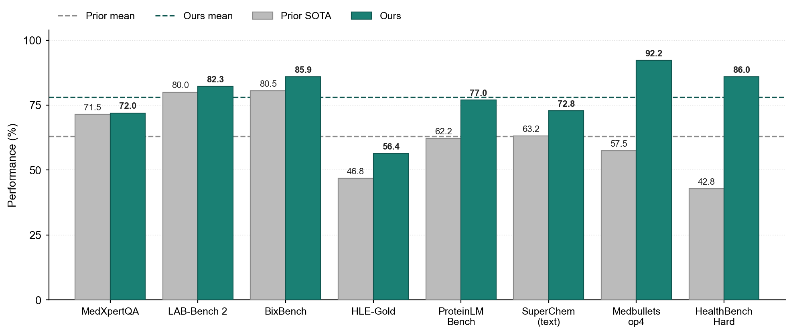

# BioMedArena

## [BioMedArena: An Open-source Toolkit for Building and Evaluating Biomedical Deep Research Agents](https://arxiv.org/abs/2605.06177)

##### If you find BioMedArena useful, please give us a star on GitHub for the latest updates.

[](https://arxiv.org/abs/2605.06177)
[](https://github.com/AI-in-Health/BioMedArena)
[](docs/benchmark_datasets.md)
[](docs/tools_and_skills.md)

Reproducing and comparing deep research agents today is hard: the same
backbone evaluated on the same benchmark can report different accuracies across
papers because the harness and tool registry differ, and integrating a new
model into a comparable evaluation surface costs weeks of model-specific
engineering. These are symptoms of a broader reproducibility problem in deep
research agent research. We release BioMedArena, an open-source toolkit that
addresses this reproducibility gap and provides an arena for comparing
biomedical deep research agents under a shared evaluation environment.

BioMedArena decouples six layers of biomedical agent evaluation: benchmark
loading, tool exposure, tool selection, harness mode, context management, and
scoring. The current public code exposes 166 registered benchmark entries
(155 canonical benchmarks plus 11 deprecated compatibility aliases), 76 tools
across 9 biomedical functional families, 4 modes, and 9 registered model
backbone IDs. Adding a new model, benchmark, or tool reduces to registering a
small provider adapter, loader, or schema/handler pair.

<p align="center">
  
</p>

## Overall Performance

Scroll horizontally to view all benchmark columns.

<table>
  <thead>
    <tr>
      <th rowspan="2">Type</th>
      <th rowspan="2">Model</th>
      <th rowspan="2">Setting</th>
      <th rowspan="2">HealthBench Hard<br>(1000)</th>
      <th rowspan="2">MedXpertQA<br>(2450)</th>
      <th rowspan="2">ProteinLMBench<br>(944)</th>
      <th rowspan="2">Medbullets<br>(308)</th>
      <th colspan="3">SuperChem (500)</th>
      <th rowspan="2">BixBench<br>(205)</th>
      <th colspan="3">HLE-Gold (149)</th>
      <th rowspan="2">LAB-Bench 2<br>(821)</th>
    </tr>
    <tr>
      <th>Text</th>
      <th>Image</th>
      <th>Total</th>
      <th>Bio</th>
      <th>Chem</th>
      <th>Total</th>
    </tr>
  </thead>
  <tbody>
    <tr>
      <td></td>
      <td>SOTA</td>
      <td>-</td>
      <td><a href="https://venturebeat.com/technology/goodbye-llama-meta-launches-new-proprietary-ai-model-muse-spark-first-since">42.8</a></td>
      <td><a href="https://medium.com/@mrAryanKumar/5-surprising-truths-about-metas-14-billion-muse-spark-comeback-1efe8f76cc28">71.5</a></td>
      <td><a href="https://arxiv.org/abs/2406.05540">62.2</a></td>
      <td><a href="https://arxiv.org/abs/2504.00993">57.5</a></td>
      <td><a href="https://arxiv.org/pdf/2603.15726">63.2</a></td>
      <td>-</td>
      <td><a href="https://arxiv.org/abs/2512.01274">38.5</a></td>
      <td><a href="https://edisonscientific.com/articles/edison-literature-agent">80.5</a></td>
      <td><a href="https://edisonscientific.com/articles/edison-literature-agent">44.2</a></td>
      <td><a href="https://edisonscientific.com/articles/edison-literature-agent">53.2</a></td>
      <td><a href="https://edisonscientific.com/articles/edison-literature-agent">46.8</a></td>
      <td><a href="https://edisonscientific.com/articles/edison-literature-agent">80.0</a></td>
    </tr>
    <tr>
      <td rowspan="10">Public LLMs</td>
      <td><a href="https://huggingface.co/arcee-ai/Trinity-Large-Thinking">Trinity-Large-Thinking</a></td>
      <td>Baseline</td>
      <td>41.9</td><td>33.3</td><td>39.0</td><td>77.3</td><td>23.8</td><td>-</td><td>-</td><td>5.4</td><td>15.0</td><td>7.1</td><td>12.8</td><td>43.5</td>
    </tr>
    <tr>
      <td><a href="https://huggingface.co/arcee-ai/Trinity-Large-Thinking">Trinity-Large-Thinking</a></td>
      <td>Ours</td>
      <td>47.7</td><td>44.2</td><td>69.5</td><td>82.1</td><td>30.6</td><td>-</td><td>-</td><td>26.3</td><td>19.6</td><td>19.0</td><td>19.5</td><td>61.0</td>
    </tr>
    <tr>
      <td><a href="https://huggingface.co/nvidia/NVIDIA-Nemotron-3-Super-120B-A12B-BF16">NVIDIA Nemotron-3 Super 120B</a></td>
      <td>Baseline</td>
      <td>58.7</td><td>37.8</td><td>50.5</td><td>79.2</td><td>32.5</td><td>-</td><td>-</td><td>13.2</td><td>13.1</td><td>4.8</td><td>10.7</td><td>43.6</td>
    </tr>
    <tr>
      <td><a href="https://huggingface.co/nvidia/NVIDIA-Nemotron-3-Super-120B-A12B-BF16">NVIDIA Nemotron-3 Super 120B</a></td>
      <td>Ours</td>
      <td>65.4</td><td>45.9</td><td>63.1</td><td>82.5</td><td>39.6</td><td>-</td><td>-</td><td>10.7</td><td>28.0</td><td>33.3</td><td>29.5</td><td>62.6</td>
    </tr>
    <tr>
      <td><a href="https://huggingface.co/PrimeIntellect/INTELLECT-3.1">INTELLECT-3.1</a></td>
      <td>Baseline</td>
      <td>41.1</td><td>36.2</td><td>43.5</td><td>72.7</td><td>27.9</td><td>-</td><td>-</td><td>5.4</td><td>20.6</td><td>9.5</td><td>17.4</td><td>43.5</td>
    </tr>
    <tr>
      <td><a href="https://huggingface.co/PrimeIntellect/INTELLECT-3.1">INTELLECT-3.1</a></td>
      <td>Ours</td>
      <td>48.2</td><td>37.5</td><td>65.6</td><td>75.0</td><td>29.4</td><td>-</td><td>-</td><td>20.0</td><td>26.2</td><td>19.0</td><td>24.2</td><td>57.9</td>
    </tr>
    <tr>
      <td><a href="https://huggingface.co/zai-org/GLM-4.5">GLM-4.5</a></td>
      <td>Baseline</td>
      <td>42.0</td><td>35.3</td><td>59.2</td><td>79.2</td><td>21.1</td><td>-</td><td>-</td><td>23.9</td><td>16.8</td><td>2.4</td><td>12.8</td><td>44.8</td>
    </tr>
    <tr>
      <td><a href="https://huggingface.co/zai-org/GLM-4.5">GLM-4.5</a></td>
      <td>Ours</td>
      <td>45.3</td><td>36.5</td><td>63.1</td><td>81.2</td><td>28.3</td><td>-</td><td>-</td><td>30.2</td><td>28.0</td><td>28.6</td><td>28.2</td><td>61.5</td>
    </tr>
    <tr>
      <td><a href="https://huggingface.co/Qwen/Qwen3-235B-A22B">Qwen3-235B-A22B</a></td>
      <td>Baseline</td>
      <td>27.9</td><td>40.5</td><td>54.0</td><td>79.5</td><td>23.4</td><td>-</td><td>-</td><td>22.4</td><td>15.0</td><td>14.3</td><td>14.8</td><td>42.5</td>
    </tr>
    <tr>
      <td><a href="https://huggingface.co/Qwen/Qwen3-235B-A22B">Qwen3-235B-A22B</a></td>
      <td>Ours</td>
      <td>32.4</td><td>40.8</td><td>62.2</td><td>83.1</td><td>37.7</td><td>-</td><td>-</td><td>35.1</td><td>28.0</td><td>14.3</td><td>24.2</td><td>57.9</td>
    </tr>
    <tr>
      <td rowspan="14">Commercial LLMs</td>
      <td><a href="https://developers.openai.com/api/docs/models/gpt-5.4">GPT-5.4</a></td>
      <td>Baseline</td>
      <td>61.3</td><td>44.7</td><td>67.6</td><td>84.8</td><td>57.7</td><td>22.6</td><td>41.2</td><td>40.0</td><td>43.0</td><td>33.3</td><td>40.3</td><td>48.5</td>
    </tr>
    <tr>
      <td><a href="https://developers.openai.com/api/docs/models/gpt-5.4">GPT-5.4</a></td>
      <td>Ours</td>
      <td>77.2</td><td>57.3</td><td>70.0</td><td>91.8</td><td>66.8</td><td>58.3</td><td>62.8</td><td>49.8</td><td>48.6</td><td>54.8</td><td>50.3</td><td>72.1</td>
    </tr>
    <tr>
      <td><a href="https://blog.google/products/gemini/gemini-3-flash/">Gemini 3 Flash</a></td>
      <td>Baseline</td>
      <td>59.7</td><td>52.9</td><td>65.7</td><td>64.9</td><td>49.1</td><td>10.2</td><td>30.8</td><td>38.5</td><td>39.3</td><td>28.6</td><td>36.2</td><td>51.9</td>
    </tr>
    <tr>
      <td><a href="https://blog.google/products/gemini/gemini-3-flash/">Gemini 3 Flash</a></td>
      <td>Ours</td>
      <td>80.7</td><td>63.6</td><td>72.1</td><td>85.4</td><td>54.0</td><td>34.5</td><td>44.8</td><td>69.3</td><td>51.4</td><td>47.6</td><td>50.3</td><td>59.8</td>
    </tr>
    <tr>
      <td><a href="https://blog.google/innovation-and-ai/models-and-research/gemini-models/gemini-3-1-pro/">Gemini 3.1 Pro</a></td>
      <td>Baseline</td>
      <td>72.0</td><td>58.9</td><td>70.3</td><td>70.1</td><td>54.3</td><td>19.2</td><td>37.8</td><td>42.4</td><td>41.1</td><td>47.6</td><td>43.0</td><td>52.1</td>
    </tr>
    <tr>
      <td><a href="https://blog.google/innovation-and-ai/models-and-research/gemini-models/gemini-3-1-pro/">Gemini 3.1 Pro</a></td>
      <td>Ours</td>
      <td>80.8</td><td>72.0</td><td>77.0</td><td>91.6</td><td>57.4</td><td>62.6</td><td>59.8</td><td>85.9</td><td>49.5</td><td>50.0</td><td>49.7</td><td>70.9</td>
    </tr>
    <tr>
      <td><a href="https://www.anthropic.com/news/claude-sonnet-4-5">Claude Sonnet 4.5</a></td>
      <td>Baseline</td>
      <td>67.9</td><td>45.9</td><td>58.7</td><td>88.3</td><td>29.1</td><td>17.4</td><td>23.6</td><td>17.1</td><td>22.4</td><td>16.7</td><td>20.8</td><td>48.1</td>
    </tr>
    <tr>
      <td><a href="https://www.anthropic.com/news/claude-sonnet-4-5">Claude Sonnet 4.5</a></td>
      <td>Ours</td>
      <td>75.3</td><td>60.1</td><td>72.8</td><td>91.2</td><td>39.6</td><td>31.9</td><td>35.4</td><td>42.4</td><td>42.1</td><td>40.5</td><td>41.6</td><td>71.5</td>
    </tr>
    <tr>
      <td><a href="https://www.anthropic.com/research/claude-sonnet-4-6">Claude Sonnet 4.6</a></td>
      <td>Baseline</td>
      <td>69.3</td><td>51.0</td><td>60.3</td><td>86.0</td><td>40.4</td><td>24.7</td><td>33.0</td><td>40.5</td><td>24.3</td><td>21.4</td><td>23.5</td><td>49.3</td>
    </tr>
    <tr>
      <td><a href="https://www.anthropic.com/research/claude-sonnet-4-6">Claude Sonnet 4.6</a></td>
      <td>Ours</td>
      <td>86.0</td><td>62.4</td><td>64.7</td><td>89.0</td><td>66.0</td><td>53.6</td><td>58.6</td><td>48.3</td><td>42.1</td><td>50.0</td><td>44.3</td><td>74.3</td>
    </tr>
    <tr>
      <td><a href="https://www.anthropic.com/news/claude-opus-4-5">Claude Opus 4.5</a></td>
      <td>Baseline</td>
      <td>72.5</td><td>49.4</td><td>63.8</td><td>87.3</td><td>48.3</td><td>24.3</td><td>37.0</td><td>41.0</td><td>30.8</td><td>31.0</td><td>30.9</td><td>49.8</td>
    </tr>
    <tr>
      <td><a href="https://www.anthropic.com/news/claude-opus-4-5">Claude Opus 4.5</a></td>
      <td>Ours</td>
      <td>78.9</td><td>62.0</td><td>69.8</td><td>90.3</td><td>59.2</td><td>41.3</td><td>50.8</td><td>50.2</td><td>49.5</td><td>50.0</td><td>49.7</td><td>73.8</td>
    </tr>
    <tr>
      <td><a href="https://www.anthropic.com/news/claude-opus-4-6">Claude Opus 4.6</a></td>
      <td>Baseline</td>
      <td>76.2</td><td>55.8</td><td>64.4</td><td>89.9</td><td>62.3</td><td>30.2</td><td>47.2</td><td>42.0</td><td>36.4</td><td>42.9</td><td>38.3</td><td>51.2</td>
    </tr>
    <tr>
      <td><a href="https://www.anthropic.com/news/claude-opus-4-6">Claude Opus 4.6</a></td>
      <td>Ours</td>
      <td>80.2</td><td>66.0</td><td>71.8</td><td>92.2</td><td>72.8</td><td>57.9</td><td>65.8</td><td>53.7</td><td>55.1</td><td>59.5</td><td>56.4</td><td>82.3</td>
    </tr>
  </tbody>
</table>

## Documentation

The root README stays short on purpose. Detailed release information
lives in `docs/`:

- [Benchmark dataset inventory](docs/benchmark_datasets.md)
- [Tools and skills inventory](docs/tools_and_skills.md)
- [API reference](docs/api_reference.md)
- [Metrics guide](docs/metrics_guide.md)

## Quick Check

After installing dependencies, run the offline smoke suite:

```bash
python3 scripts/run_quick_suite.py
```

Expected healthy output:

- 166 registered benchmarks
- 76 registered tools
- 4 registered modes
- 20/20 scorer checks passed

For the stricter offline release gate:

```bash
python3 scripts/release_gate.py --strict
```

Prepare the full BixBench agent setting only when you need the official
capsule-backed protocol. This downloads the large `CapsuleFolder-{uuid}.zip`
files explicitly instead of during normal benchmark loading:

```bash
biomedarena prepare-bixbench --revision main --extract
docker build -t biomedarena/bixbench-sandbox:latest docker/bixbench
biomedarena run --benchmark bixbench --bixbench-form open --bixbench-capsules \
  --backbone gemini-3-flash-preview --tools biomed --reasoning-mode heavy
```

If you are running fully offline from a cache you prepared yourself, add
`--bixbench-offline-metadata` to the `run` command. The open-form path is
official-compatible: it uses the public BixBench rows, mounted data capsules,
and `eval_mode`-specific scoring, while the external FutureHouse evaluator is
not vendored in this repository.

## Installation

```bash
git clone https://github.com/AI-in-Health/BioMedArena.git
cd BioMedArena

python3.11 -m venv .venv
source .venv/bin/activate

python -m pip install -e ".[dev,eval,provider-gemini]"

cp .env.example .env
```

Fill at least one model provider key in `.env`:

```bash
OPENAI_API_KEY=<your-openai-api-key>
ANTHROPIC_API_KEY=<your-anthropic-api-key>
GEMINI_API_KEY=<your-gemini-api-key>
HF_TOKEN=<your-huggingface-token-for-gated-benchmarks>
```

Gated HuggingFace datasets also require accepting the dataset terms in
the browser before `HF_TOKEN` can load them. See `.env.example` for
optional domain-specific keys such as NCBI, OMIM, Serper, and Jina.

## Basic Usage

List available resources:

```bash
biomedarena list-benchmarks
biomedarena list-backbones
biomedarena list-modes
```

The package name and command-line entry point are both `biomedarena`.
Environment variables use the `BIOMEDARENA_` prefix.

Run one benchmark cell:

```bash
biomedarena run \
  --benchmark medcalc \
  --backbone gemini-2.5-flash \
  --tools biomed --reasoning-mode light \
  --limit 5 \
  --output result.json
```

Run a small matrix cell:

```bash
python3 scripts/run_matrix.py \
  --config configs/matrix_default.yaml \
  --only medcalc,gemini,simple_llm \
  --limit-override 1
```

For the 7-setting quick-start experiment suite used to compare thinking,
domain tools, web search, and combined tool use, see [`quick_run.sh`](quick_run.sh).

Check official source accessibility before spending model budget:

```bash
python3 scripts/verify_benchmark_sources.py --benchmarks all
```

## Execution Modes

The public CLI exposes four modes:

| Mode | Purpose |
| --- | --- |
| `simple_llm` | Pure model baseline, no tools. |
| `deep_think` | Native model reasoning/thinking path where supported. |
| `light` | Single-turn function/tool calling. |
| `heavy` | Multi-turn ReAct loop with tool retrieval. |

A unified CLI interface is also available via `--tools` / `--reasoning-mode` /
`--enable-thinking` flags, which map to the modes above:

| `--tools` | `--reasoning-mode` | Internal mode | Thinking |
| --- | --- | --- | --- |
| `off` | (n/a) | `deep_think` | ON (default) |
| `off` + `--enable-thinking 0` | (n/a) | `simple_llm` | OFF |
| `biomed` / `search` / `all` | `light` | `light` | OFF |
| `biomed` / `search` / `all` | `heavy` | `heavy` | ON |

The legacy `--mode` / `--web-tools` flags remain supported for backward
compatibility. Add `--self-consistency` to wrap any mode with majority voting.

## Security

`python_exec` can execute model-supplied Python with timeout and basic
denylist checks. Treat this as a convenience guard, not a hardened
sandbox. Run untrusted workloads in an isolated container or VM, keep
secrets out of the working directory, and disable code-execution or
web-search tools for private data unless you have reviewed the policy.

External tools may call third-party APIs and public databases. Review
the benchmark and tool inventories before running sensitive workloads.

## Testing

```bash
python3 scripts/run_quick_suite.py
python3 scripts/release_gate.py --strict
python3 -m pytest tests/unit -q
HF_HOME=/tmp/biomedarena_hf_empty \
HF_DATASETS_CACHE=/tmp/biomedarena_hf_datasets_empty \
HF_TOKEN= HUGGING_FACE_HUB_TOKEN= HUGGINGFACE_HUB_TOKEN= \
python3 -m pytest tests/smoke -q -m "not slow"
```

## Citation

```bibtex
@article{wu2026biomedarena,
  title={BioMedArena: An Open-source Toolkit for Building and Evaluating Biomedical Deep Research Agents},
  author={Wu, J and Zhou, H and Zeng, M and Zhu, J and Wu, J and Pan, J and Noori, A and Wu, S and Wu, H and Liu, F and Clifton, D A},
  journal={arXiv preprint arXiv:2605.06177},
  year={2026}
}
```

## License

See [LICENSE](LICENSE). Ported life-science skill attribution is tracked
in [harness/tools/openai_ported/NOTICE.md](harness/tools/openai_ported/NOTICE.md).
